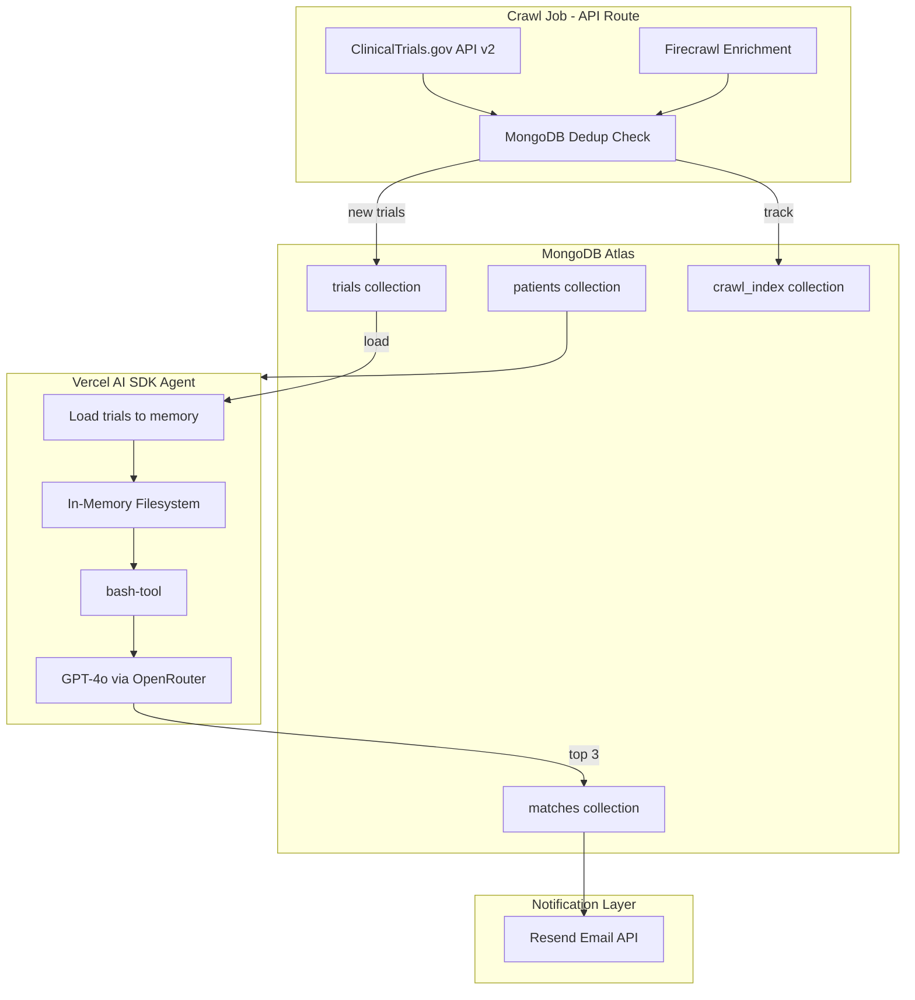

# Clinical Trial Matcher - Hackathon Implementation Plan

## Architecture Overview




## Tech Stack Decision


| Component            | Choice                             | Rationale                                                                    |
| -------------------- | ---------------------------------- | ---------------------------------------------------------------------------- |
| **Framework**        | Next.js + Vercel AI SDK            | Native bash-tool support, TypeScript, optimized for Vercel                   |
| **Agent Tools**      | bash-tool                          | Vercel's package for filesystem navigation - exactly what we need            |
| **Database**         | MongoDB Atlas                      | **Headliner sponsor with prize track**, native Vercel integration, free tier |
| **LLM**              | GPT-4o via OpenRouter              | 88% criterion-level accuracy, **OpenRouter is sponsor**                      |
| **Web Scraping**     | Firecrawl + ClinicalTrials.gov API | **Firecrawl is host**, official API for structured data                      |
| **Document Parsing** | Reducto                            | **Reducto is host**, handles complex medical PDFs (stretch goal)             |
| **Email**            | Resend                             | **Resend is host**, reliable transactional emails                            |
| **Deployment**       | Vercel                             | Native MongoDB integration, AI SDK optimized, free tier                      |


## How bash-tool Works with MongoDB

The key insight: **Vercel's bash-tool creates an in-memory filesystem** that the agent navigates using bash commands. We store trials in MongoDB, then load them into this virtual filesystem when the agent runs.

```typescript
// Load trials from MongoDB into in-memory filesystem
const trials = await db.collection('trials').find({ condition: 'multiple_sclerosis' }).toArray();

const files: Record<string, string> = {};
for (const trial of trials) {
  const path = `trials/${trial.condition}/${trial.phase}/${trial.nctId}.md`;
  files[path] = trial.markdownContent;
}

// Create bash-tool with loaded files
const { tools } = await createBashTool({ files });

// Agent can now run: ls trials/, grep, cat, etc.
```

**Virtual Filesystem Structure (in-memory):**

```
trials/
├── multiple_sclerosis/
│   ├── phase1/
│   │   └── NCT12345678.md
│   ├── phase2/
│   │   ├── NCT23456789.md
│   │   └── NCT34567890.md
│   └── phase3/
│       └── NCT45678901.md
└── breast_cancer/
    ├── phase1/
    ├── phase2/
    └── phase3/
```

**Trial Markdown Template (stored in MongoDB `markdownContent` field):**

```markdown
# Trial: NCT12345678

## Basic Info
- **Title:** A Phase 2 Study of Drug X for Relapsing MS
- **Phase:** 2
- **Status:** Recruiting
- **Condition:** Multiple Sclerosis, Relapsing-Remitting
- **Intervention:** Drug X (oral, 10mg daily)
- **Sponsor:** Pharma Corp

## Eligibility Criteria

### Inclusion
- Age 18-55 years
- Diagnosed with RRMS per McDonald criteria
- At least 1 relapse in past 12 months
- EDSS score 0-5.5

### Exclusion
- Prior treatment with Drug Y or Drug Z
- Active infection
- Pregnancy or breastfeeding
- Significant cardiac disease

## Locations
- San Francisco, CA - UCSF Medical Center
- Boston, MA - Mass General Hospital
- New York, NY - Mount Sinai

## Contact
- Principal Investigator: Dr. Jane Smith
- Email: jsmith@example.com
- Phone: (555) 123-4567

## Dates
- Start: 2024-03-01
- Estimated Completion: 2026-06-01

## Source
- ClinicalTrials.gov: https://clinicaltrials.gov/study/NCT12345678
- Last Updated: 2025-01-30
```

## MongoDB Schema

**trials collection:**

```typescript
{
  _id: ObjectId,
  nctId: string,           // "NCT12345678" - unique index
  title: string,
  condition: string,       // normalized: "multiple_sclerosis"
  phase: string,           // "phase1", "phase2", "phase3"
  status: string,          // "Recruiting", "Active", etc.
  intervention: string,
  eligibilityCriteria: {
    inclusion: string[],
    exclusion: string[]
  },
  locations: string[],
  contact: {
    name: string,
    email: string,
    phone: string
  },
  dates: {
    start: Date,
    estimatedCompletion: Date
  },
  sourceUrl: string,
  markdownContent: string,  // Full markdown for bash-tool
  sourceHash: string,       // For deduplication
  lastScraped: Date,
  createdAt: Date,
  updatedAt: Date
}
// Indexes: { nctId: 1 } unique, { condition: 1, phase: 1 }
```

**patients collection:**

```typescript
{
  _id: ObjectId,
  name: string,
  email: string,
  age: number,
  condition: string,        // "multiple_sclerosis"
  priorTreatments: string[],
  comorbidities: string[],
  location: string,         // "San Francisco, CA"
  budgetConstraints: string,
  timeCommitment: string,
  doctorName: string,
  doctorEmail: string,
  createdAt: Date,
  updatedAt: Date
}
```

**matches collection:**

```typescript
{
  _id: ObjectId,
  patientId: ObjectId,
  nctId: string,
  trialTitle: string,
  matchScore: number,       // 0-100
  reasoning: string,        // LLM explanation
  status: string,           // "pending", "notified", "enrolled"
  createdAt: Date
}
// Index: { patientId: 1, createdAt: -1 }
```

**crawl_index collection:** (for deduplication)

```typescript
{
  _id: ObjectId,
  nctId: string,            // unique index
  sourceHash: string,
  lastScraped: Date
}
```

## Implementation Steps

### Phase 1: Project Setup (30 min)

**1.1 Initialize Next.js Project**

```bash
npx create-next-app@latest clinical-trial-matcher --typescript --tailwind --app
cd clinical-trial-matcher
npm install ai @ai-sdk/openai bash-tool mongodb resend zod
npm install @mendable/firecrawl-js  # Firecrawl SDK
```

**1.2 Project Structure**

```
clinical-trial-matcher/
├── app/
│   ├── api/
│   │   ├── crawl/
│   │   │   └── route.ts        # Crawl job endpoint
│   │   ├── patients/
│   │   │   └── route.ts        # Patient CRUD
│   │   ├── match/
│   │   │   └── route.ts        # Trigger matching
│   │   └── chat/
│   │       └── route.ts        # Agent streaming endpoint
│   ├── patients/
│   │   └── page.tsx            # Patient form UI
│   ├── dashboard/
│   │   └── page.tsx            # Status dashboard
│   └── page.tsx                # Landing page
├── lib/
│   ├── mongodb.ts              # MongoDB client
│   ├── clinicaltrials.ts       # ClinicalTrials.gov API
│   ├── firecrawl.ts            # Firecrawl client
│   ├── trial-loader.ts         # Load trials to memory FS
│   ├── agent.ts                # Matching agent with bash-tool
│   └── email.ts                # Resend client
├── .env.local                  # Environment variables
└── package.json
```

### Phase 2: Crawl Job with Deduplication (2 hours)

**2.1 ClinicalTrials.gov API Integration**

```typescript
// lib/clinicaltrials.ts
const CLINICALTRIALS_API = 'https://clinicaltrials.gov/api/v2/studies';

export async function fetchTrials(condition: string, pageSize = 50) {
  const params = new URLSearchParams({
    'query.cond': condition,
    'filter.overallStatus': 'RECRUITING',
    'pageSize': pageSize.toString(),
  });
  
  const response = await fetch(`${CLINICALTRIALS_API}?${params}`);
  const data = await response.json();
  return data.studies;
}
```

**2.2 Crawl Job with MongoDB Deduplication**

```typescript
// app/api/crawl/route.ts
import { NextResponse } from 'next/server';
import { getDb } from '@/lib/mongodb';
import { fetchTrials } from '@/lib/clinicaltrials';
import { enrichWithFirecrawl } from '@/lib/firecrawl';
import { createHash } from 'crypto';

export async function POST(request: Request) {
  const { condition } = await request.json();
  const db = await getDb();
  
  // 1. Fetch from ClinicalTrials.gov
  const trials = await fetchTrials(condition);
  
  // 2. Check existing in MongoDB
  const existingIndex = await db.collection('crawl_index')
    .find({})
    .toArray();
  const existingMap = new Map(existingIndex.map(t => [t.nctId, t.sourceHash]));
  
  // 3. Filter to new/updated only
  const newTrials = [];
  for (const trial of trials) {
    const nctId = trial.protocolSection.identificationModule.nctId;
    const sourceHash = createHash('md5').update(JSON.stringify(trial)).digest('hex');
    
    if (!existingMap.has(nctId) || existingMap.get(nctId) !== sourceHash) {
      newTrials.push({ ...trial, nctId, sourceHash });
    }
  }
  
  // 4. Enrich new trials with Firecrawl
  for (const trial of newTrials) {
    const enriched = await enrichWithFirecrawl(trial.nctId);
    Object.assign(trial, enriched);
  }
  
  // 5. Generate markdown and store in MongoDB
  for (const trial of newTrials) {
    const markdown = generateTrialMarkdown(trial);
    const doc = {
      nctId: trial.nctId,
      title: trial.protocolSection.identificationModule.briefTitle,
      condition: normalizeCondition(condition),
      phase: normalizePhase(trial.protocolSection.designModule?.phases),
      status: trial.protocolSection.statusModule.overallStatus,
      // ... other fields
      markdownContent: markdown,
      sourceHash: trial.sourceHash,
      lastScraped: new Date(),
      updatedAt: new Date(),
    };
    
    await db.collection('trials').updateOne(
      { nctId: trial.nctId },
      { $set: doc, $setOnInsert: { createdAt: new Date() } },
      { upsert: true }
    );
    
    await db.collection('crawl_index').updateOne(
      { nctId: trial.nctId },
      { $set: { sourceHash: trial.sourceHash, lastScraped: new Date() } },
      { upsert: true }
    );
  }
  
  return NextResponse.json({
    total: trials.length,
    new: newTrials.length,
    skipped: trials.length - newTrials.length
  });
}
```

**2.3 Firecrawl Enrichment**

```typescript
// lib/firecrawl.ts
import FirecrawlApp from '@mendable/firecrawl-js';

const firecrawl = new FirecrawlApp({ apiKey: process.env.FIRECRAWL_API_KEY });

export async function enrichWithFirecrawl(nctId: string) {
  const url = `https://clinicaltrials.gov/study/${nctId}`;
  
  const result = await firecrawl.scrapeUrl(url, {
    formats: ['markdown'],
    onlyMainContent: true,
  });
  
  // Extract additional contact info, site details not in API
  return {
    enrichedContent: result.markdown,
    scrapedAt: new Date(),
  };
}
```

### Phase 3: Patient Management (1 hour)

**3.1 Patient API Route**

```typescript
// app/api/patients/route.ts
import { NextResponse } from 'next/server';
import { getDb } from '@/lib/mongodb';
import { ObjectId } from 'mongodb';

export async function POST(request: Request) {
  const patient = await request.json();
  const db = await getDb();
  
  const result = await db.collection('patients').insertOne({
    ...patient,
    createdAt: new Date(),
    updatedAt: new Date(),
  });
  
  return NextResponse.json({ id: result.insertedId });
}

export async function GET() {
  const db = await getDb();
  const patients = await db.collection('patients').find({}).toArray();
  return NextResponse.json(patients);
}
```

**3.2 Simple Patient Form (React)**

```typescript
// app/patients/page.tsx
'use client';
import { useState } from 'react';

export default function PatientForm() {
  const [formData, setFormData] = useState({
    name: '',
    email: '',
    age: '',
    condition: 'multiple_sclerosis',
    location: '',
    priorTreatments: '',
    comorbidities: '',
    budgetConstraints: '',
    timeCommitment: '',
    doctorName: '',
    doctorEmail: '',
  });

  const handleSubmit = async (e: React.FormEvent) => {
    e.preventDefault();
    const response = await fetch('/api/patients', {
      method: 'POST',
      headers: { 'Content-Type': 'application/json' },
      body: JSON.stringify({
        ...formData,
        age: parseInt(formData.age),
        priorTreatments: formData.priorTreatments.split(',').map(s => s.trim()),
        comorbidities: formData.comorbidities.split(',').map(s => s.trim()),
      }),
    });
    // Handle response...
  };

  return (
    <form onSubmit={handleSubmit} className="max-w-2xl mx-auto p-4">
      {/* Form fields - functional, not pretty */}
    </form>
  );
}
```

### Phase 4: Matching Agent with bash-tool (2-3 hours)

**4.1 Trial Loader - MongoDB to In-Memory Filesystem**

```typescript
// lib/trial-loader.ts
import { getDb } from './mongodb';

export async function loadTrialsToFilesystem(condition?: string) {
  const db = await getDb();
  
  const query = condition ? { condition } : {};
  const trials = await db.collection('trials').find(query).toArray();
  
  const files: Record<string, string> = {};
  
  for (const trial of trials) {
    const path = `trials/${trial.condition}/${trial.phase}/${trial.nctId}.md`;
    files[path] = trial.markdownContent;
  }
  
  // Add an index file for quick reference
  files['trials/index.txt'] = trials
    .map(t => `${t.nctId}: ${t.title} (${t.condition}/${t.phase})`)
    .join('\n');
  
  return files;
}
```

**4.2 Matching Agent with Vercel AI SDK + bash-tool**

```typescript
// lib/agent.ts
import { createOpenAI } from '@ai-sdk/openai';
import { generateText } from 'ai';
import { createBashTool } from 'bash-tool';
import { loadTrialsToFilesystem } from './trial-loader';
import { getDb } from './mongodb';
import { ObjectId } from 'mongodb';

const openrouter = createOpenAI({
  baseURL: 'https://openrouter.ai/api/v1',
  apiKey: process.env.OPENROUTER_API_KEY,
});

const SYSTEM_PROMPT = `You are a clinical trial matching agent. You have access to a filesystem of clinical trials organized as:
trials/{condition}/{phase}/{nctId}.md

You can use bash commands to navigate and search:
- ls trials/ - list all conditions
- ls trials/{condition}/ - list phases
- ls trials/{condition}/{phase}/ - list trials
- cat trials/{condition}/{phase}/{nctId}.md - read trial details
- grep -r "keyword" trials/ - search for specific criteria
- cat trials/index.txt - see all trials at a glance

Your task:
1. Given a patient profile, navigate to their condition folder
2. Search through trials to find potential matches
3. Read promising trial files to check eligibility criteria against patient profile
4. Score each trial 0-100 based on how well the patient fits
5. Return EXACTLY 3 matches in JSON format

Scoring guidelines:
- 90-100: Patient clearly meets all inclusion criteria, no exclusion criteria apply
- 70-89: Patient likely eligible, minor uncertainties
- 50-69: Patient may be eligible, some criteria unclear
- Below 50: Patient likely ineligible

Be thorough - use grep to filter, then cat to read full details.
When done, output your final answer as JSON:
{
  "matches": [
    { "nctId": "NCT...", "title": "...", "score": 92, "reasoning": "..." },
    { "nctId": "NCT...", "title": "...", "score": 85, "reasoning": "..." },
    { "nctId": "NCT...", "title": "...", "score": 78, "reasoning": "..." }
  ]
}`;

export async function runMatchingAgent(patientId: string) {
  const db = await getDb();
  
  // 1. Get patient
  const patient = await db.collection('patients').findOne({ 
    _id: new ObjectId(patientId) 
  });
  if (!patient) throw new Error('Patient not found');
  
  // 2. Load trials into in-memory filesystem
  const files = await loadTrialsToFilesystem(patient.condition);
  
  // 3. Create bash-tool with loaded files
  const { tools } = await createBashTool({ files });
  
  // 4. Build patient context
  const patientContext = `
Patient Profile:
- Name: ${patient.name}
- Age: ${patient.age}
- Condition: ${patient.condition}
- Location: ${patient.location}
- Prior Treatments: ${patient.priorTreatments?.join(', ') || 'None'}
- Comorbidities: ${patient.comorbidities?.join(', ') || 'None'}
- Budget Constraints: ${patient.budgetConstraints || 'None specified'}
- Time Commitment: ${patient.timeCommitment || 'Flexible'}

Find the top 3 clinical trials for this patient. Use the filesystem to explore available trials.
`;

  // 5. Run agent with tool loop
  const result = await generateText({
    model: openrouter('openai/gpt-4o'),
    system: SYSTEM_PROMPT,
    prompt: patientContext,
    tools,
    maxSteps: 20, // Allow multiple tool calls
  });
  
  // 6. Parse matches from response
  const matches = parseMatchesFromResponse(result.text);
  
  // 7. Store matches in MongoDB
  for (const match of matches) {
    await db.collection('matches').insertOne({
      patientId: new ObjectId(patientId),
      nctId: match.nctId,
      trialTitle: match.title,
      matchScore: match.score,
      reasoning: match.reasoning,
      status: 'pending',
      createdAt: new Date(),
    });
  }
  
  return { patient, matches, steps: result.steps };
}

function parseMatchesFromResponse(text: string) {
  const jsonMatch = text.match(/\{[\s\S]*"matches"[\s\S]*\}/);
  if (jsonMatch) {
    return JSON.parse(jsonMatch[0]).matches;
  }
  return [];
}
```

**4.3 Match API Endpoint**

```typescript
// app/api/match/route.ts
import { NextResponse } from 'next/server';
import { runMatchingAgent } from '@/lib/agent';
import { sendMatchNotification } from '@/lib/email';

export async function POST(request: Request) {
  const { patientId } = await request.json();
  
  // Run matching agent
  const { patient, matches, steps } = await runMatchingAgent(patientId);
  
  // Send email notification
  await sendMatchNotification(patient, matches);
  
  return NextResponse.json({
    patient: patient.name,
    matches,
    agentSteps: steps.length,
  });
}
```

### Phase 5: Email Notifications (1 hour)

**5.1 Resend Integration**

```typescript
// lib/email.ts
import { Resend } from 'resend';

const resend = new Resend(process.env.RESEND_API_KEY);

export async function sendMatchNotification(patient: any, matches: any[]) {
  const matchList = matches.map((m, i) => `
${i + 1}. ${m.title} (Match Score: ${m.score}%)
   - Trial ID: ${m.nctId}
   - Why it matches: ${m.reasoning}
   - Link: https://clinicaltrials.gov/study/${m.nctId}
`).join('\n');

  // Send to doctor
  await resend.emails.send({
    from: 'Clinical Trial Matcher <trials@yourdomain.com>',
    to: patient.doctorEmail,
    subject: `Clinical Trial Matches for ${patient.name}`,
    text: `
Dear Dr. ${patient.doctorName},

We found ${matches.length} potential clinical trial matches for your patient ${patient.name}:

${matchList}

Patient Profile:
- Age: ${patient.age}
- Condition: ${patient.condition}
- Location: ${patient.location}

Please review these matches and discuss with your patient.

---
Clinical Trial Matcher
    `,
  });

  // Send to patient
  await resend.emails.send({
    from: 'Clinical Trial Matcher <trials@yourdomain.com>',
    to: patient.email,
    subject: `Clinical Trial Options Found for You`,
    text: `
Dear ${patient.name},

Great news! We found ${matches.length} clinical trials that may be a good fit for you:

${matchList}

Please discuss these options with your doctor, Dr. ${patient.doctorName}.

---
Clinical Trial Matcher
    `,
  });
}
```

### Phase 6: Deployment (1 hour)

**6.1 Environment Variables**

```bash
# .env.local
MONGODB_URI=mongodb+srv://...
OPENROUTER_API_KEY=sk-or-...
FIRECRAWL_API_KEY=fc-...
RESEND_API_KEY=re_...
```

**6.2 Vercel Deployment**

1. Push to GitHub
2. Connect repo to Vercel
3. Add MongoDB Atlas via Vercel Marketplace (native integration)
4. Set environment variables in Vercel dashboard
5. Deploy

**6.3 MongoDB Atlas Setup**

1. Create free M0 cluster via Vercel integration
2. Collections auto-created on first write
3. Add indexes via MongoDB Atlas UI or script:

```typescript
// scripts/setup-indexes.ts
const db = await getDb();
await db.collection('trials').createIndex({ nctId: 1 }, { unique: true });
await db.collection('trials').createIndex({ condition: 1, phase: 1 });
await db.collection('crawl_index').createIndex({ nctId: 1 }, { unique: true });
await db.collection('matches').createIndex({ patientId: 1, createdAt: -1 });
```

## File Structure (Final)

```
clinical-trial-matcher/
├── app/
│   ├── api/
│   │   ├── crawl/route.ts          # Crawl job endpoint
│   │   ├── patients/route.ts       # Patient CRUD
│   │   ├── match/route.ts          # Trigger matching
│   │   └── trials/route.ts         # List trials
│   ├── patients/page.tsx           # Patient form
│   ├── dashboard/page.tsx          # Status dashboard
│   └── page.tsx                    # Landing page
├── lib/
│   ├── mongodb.ts                  # MongoDB client singleton
│   ├── clinicaltrials.ts           # ClinicalTrials.gov API
│   ├── firecrawl.ts                # Firecrawl enrichment
│   ├── trial-loader.ts             # Load trials to memory FS
│   ├── agent.ts                    # Matching agent
│   └── email.ts                    # Resend notifications
├── .env.local
├── package.json
└── README.md
```

## Key Tradeoffs (For Judges)

1. **In-Memory Filesystem via bash-tool**: Trials stored in MongoDB, loaded into virtual filesystem at runtime. This gives us the best of both worlds - persistent storage AND agent-friendly bash navigation. Tradeoff: memory usage scales with trial count, but fine for demo scale.
2. **MongoDB over SQL**: Document model is natural for trial data (nested eligibility criteria, variable fields). **MongoDB is headliner sponsor** - targeting their prize track.
3. **Deduplication via Hash**: We hash trial data and store in `crawl_index`. Only re-scrape when hash changes. Saves Firecrawl API calls and prevents duplicate work.
4. **GPT-4o via OpenRouter**: 88% criterion-level accuracy. **OpenRouter is sponsor**. Could use Claude for better medical reasoning, but GPT-4o is proven for this task.
5. **Vercel AI SDK**: Native bash-tool support, streaming, tool loops all built-in. Less code than building from scratch.
6. **Simple UI**: Functional React forms, not beautiful. Judges said "working systems, even if they're ugly."
7. **RRMS Focus**: Scoping to Multiple Sclerosis for demo. Architecture supports any condition.

## Demo Script

1. **Show MongoDB Atlas**: Collections with real trial data
2. **Run crawl job**: `POST /api/crawl` - show deduplication ("Found 50 trials, 3 are new")
3. **Add patient**: Fill form with realistic MS patient profile
4. **Trigger matching**: `POST /api/match` - watch agent steps in response:
  - "bash: ls trials/multiple_sclerosis/"
  - "bash: grep -r 'Age 18-55' trials/multiple_sclerosis/"
  - "bash: cat trials/multiple_sclerosis/phase2/NCT12345678.md"
5. **Show email**: Real email in inbox with top 3 matches
6. **Show matches in MongoDB**: Stored with scores and reasoning

## Risk Mitigation

- **API Rate Limits**: Trial data cached in MongoDB, crawl job has dedup
- **LLM Latency**: Pre-run matching before demo, show cached results if needed
- **Email Deliverability**: Test with real emails, verify Resend domain setup
- **MongoDB Connection**: Use connection pooling, test cold starts

## Dependencies

```json
{
  "dependencies": {
    "ai": "^4.0.0",
    "@ai-sdk/openai": "^1.0.0",
    "bash-tool": "^0.1.0",
    "mongodb": "^6.0.0",
    "resend": "^3.0.0",
    "@mendable/firecrawl-js": "^1.0.0",
    "zod": "^3.22.0",
    "next": "^14.0.0",
    "react": "^18.0.0"
  }
}
```

## API Endpoints Summary


| Endpoint             | Method | Description                       |
| -------------------- | ------ | --------------------------------- |
| `/api/crawl`         | POST   | Trigger crawl job for a condition |
| `/api/patients`      | GET    | List all patients                 |
| `/api/patients`      | POST   | Create new patient                |
| `/api/patients/[id]` | GET    | Get patient details               |
| `/api/match`         | POST   | Trigger matching for a patient    |
| `/api/trials`        | GET    | List all trials from MongoDB      |


