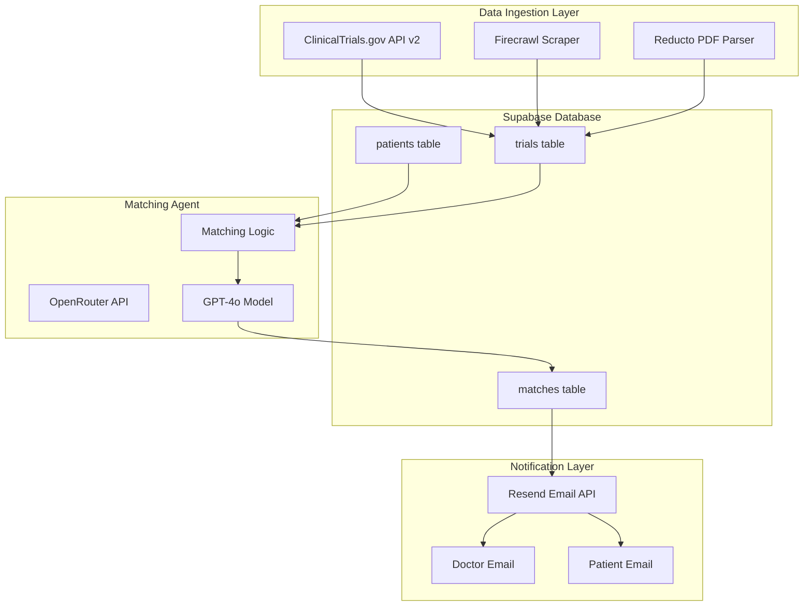

# Clinical Trial Matcher - Hackathon Implementation Plan

## Architecture Overview




## Tech Stack Decision


| Component            | Choice                             | Rationale                                                  |
| -------------------- | ---------------------------------- | ---------------------------------------------------------- |
| **Backend**          | FastAPI (Python)                   | Fast to build, async support, easy deployment              |
| **Database**         | Supabase (PostgreSQL)              | Sponsor, free tier, built-in auth, vector support          |
| **LLM**              | GPT-4o via OpenRouter              | 88% criterion-level accuracy, OpenRouter is a sponsor      |
| **Web Scraping**     | Firecrawl + ClinicalTrials.gov API | Firecrawl for enrichment, official API for structured data |
| **Document Parsing** | Reducto                            | Sponsor, handles complex medical PDFs                      |
| **Email**            | Resend                             | Sponsor, reliable transactional emails                     |
| **Deployment**       | Railway                            | Free tier, easy FastAPI deployment, public URLs            |


## Database Schema (Supabase)

**patients table:**

- `id` (uuid, primary key)
- `name` (text)
- `email` (text)
- `age` (integer)
- `condition` (text) - e.g., "RRMS", "breast cancer"
- `prior_treatments` (text[])
- `comorbidities` (text[])
- `location` (text) - city/state for geographic matching
- `budget_constraints` (text) - e.g., "insured", "limited", "flexible"
- `time_commitment` (text) - e.g., "weekly visits ok", "monthly only"
- `doctor_email` (text)
- `created_at` (timestamp)

**trials table:**

- `id` (uuid, primary key)
- `nct_id` (text, unique) - ClinicalTrials.gov identifier
- `title` (text)
- `condition` (text)
- `phase` (text)
- `status` (text) - "Recruiting", "Active", etc.
- `intervention` (text)
- `eligibility_criteria` (text) - full inclusion/exclusion text
- `locations` (text[])
- `start_date` (date)
- `completion_date` (date)
- `contact_info` (jsonb)
- `source_url` (text)
- `last_updated` (timestamp)

**matches table:**

- `id` (uuid, primary key)
- `patient_id` (uuid, foreign key)
- `trial_id` (uuid, foreign key)
- `match_score` (integer) - 0-100
- `reasoning` (text) - LLM explanation
- `status` (text) - "pending", "notified", "enrolled"
- `created_at` (timestamp)

## Implementation Steps

### Phase 1: Data Ingestion Pipeline (2-3 hours)

**1.1 ClinicalTrials.gov API Integration**

- Use the official API v2 (`https://clinicaltrials.gov/api/v2/studies`)
- Query for specific conditions (start with RRMS for demo)
- Extract: NCT ID, title, phase, status, eligibility criteria, locations
- Store structured JSON directly in Supabase

```python
# Example API call
GET https://clinicaltrials.gov/api/v2/studies?query.cond=multiple+sclerosis&filter.overallStatus=RECRUITING&pageSize=50
```

**1.2 Firecrawl Enrichment**

- Use Firecrawl's `/extract` endpoint to scrape additional details from trial pages
- Extract contact information, detailed eligibility, and supplementary data not in API
- Focus on: sponsor details, investigator info, site-specific requirements

**1.3 Reducto for PDF Protocols (Stretch)**

- Parse uploaded protocol PDFs for detailed eligibility criteria
- Extract structured data from consent forms if available

### Phase 2: Patient Management (1-2 hours)

**2.1 Simple Web Form**

- FastAPI endpoint to accept patient data
- Minimal UI using HTML/Jinja2 templates (ugly is fine per judges)
- Fields: name, email, age, condition, location, prior treatments, constraints

**2.2 Supabase Storage**

- Store patient profiles with doctor association
- Enable updates/edits via simple form

### Phase 3: Matching Agent (2-3 hours)

**3.1 Matching Logic**

- Query all recruiting trials for patient's condition
- For each trial, send to GPT-4o with patient profile and eligibility criteria
- Prompt structure:

```
You are a clinical trial matching assistant. Given a patient profile and trial eligibility criteria, determine if the patient is likely eligible.

Patient Profile:
- Age: {age}
- Condition: {condition}
- Prior Treatments: {treatments}
- Location: {location}
- Constraints: {constraints}

Trial: {trial_title}
Eligibility Criteria:
{eligibility_text}

Respond with:
1. Match Score (0-100)
2. Key matching factors (what qualifies them)
3. Potential disqualifiers (what might exclude them)
4. Recommendation (Highly Recommended / Consider / Not Recommended)
```

**3.2 OpenRouter Integration**

- Use OpenRouter API for GPT-4o access (sponsor benefit)
- Implement retry logic and error handling
- Cache results to avoid redundant API calls

**3.3 Ranking Algorithm**

- Sort matches by score
- Return top 3 matches per patient
- Store in matches table with reasoning

### Phase 4: Email Notifications (1 hour)

**4.1 Resend Integration**

- Create email template for trial match notifications
- Include: patient name, top 3 trials, match scores, reasoning, next steps
- Send to both patient and doctor emails

**4.2 Email Content Structure**

```
Subject: New Clinical Trial Matches for {patient_name}

Dear Dr. {doctor_name},

We found {n} potential clinical trial matches for your patient {patient_name}:

1. {Trial Title} (Match Score: 92%)
   - Phase: III | Status: Recruiting
   - Why it matches: {reasoning}
   - Location: {nearest_site}
   - Contact: {contact_info}

[View Full Details] [Mark as Reviewed]

---
This is an automated notification from Clinical Trial Matcher.
```

### Phase 5: Deployment (1 hour)

**5.1 Railway Deployment**

- Create `requirements.txt` with all dependencies
- Create `Procfile` or use Railway's auto-detection
- Set environment variables (API keys, Supabase URL)
- Generate public URL

**5.2 Environment Variables**

```
SUPABASE_URL=xxx
SUPABASE_KEY=xxx
OPENROUTER_API_KEY=xxx
FIRECRAWL_API_KEY=xxx
REDUCTO_API_KEY=xxx
RESEND_API_KEY=xxx
```

**5.3 Demo Data**

- Pre-populate 20-30 real trials from ClinicalTrials.gov
- Create 3-5 sample patient profiles with varying criteria
- Run matching to show real results

## File Structure

```
clinical-trial-matcher/
├── main.py                 # FastAPI app entry point
├── requirements.txt        # Dependencies
├── Procfile               # Railway deployment
├── .env.example           # Environment template
├── app/
│   ├── __init__.py
│   ├── config.py          # Settings and env vars
│   ├── database.py        # Supabase client
│   ├── models.py          # Pydantic models
│   ├── routers/
│   │   ├── patients.py    # Patient CRUD endpoints
│   │   ├── trials.py      # Trial ingestion endpoints
│   │   └── matching.py    # Matching trigger endpoint
│   ├── services/
│   │   ├── clinicaltrials.py  # ClinicalTrials.gov API
│   │   ├── firecrawl.py       # Firecrawl scraping
│   │   ├── reducto.py         # PDF parsing
│   │   ├── matcher.py         # GPT-4o matching logic
│   │   └── email.py           # Resend notifications
│   └── templates/
│       └── patient_form.html  # Simple input form
└── README.md
```

## Key Tradeoffs (For Judges)

1. **Official API vs Full Scraping**: Using ClinicalTrials.gov API v2 as primary source ensures reliable, structured data. Firecrawl supplements with enrichment data rather than being the primary source.
2. **GPT-4o vs Fine-tuned Model**: GPT-4o via OpenRouter provides 88% accuracy out-of-box. Fine-tuning would improve accuracy but isn't feasible in one day.
3. **Simple UI vs Polish**: Prioritizing working backend over beautiful frontend. HTML forms are functional, not pretty.
4. **RRMS Focus vs All Conditions**: Scoping to one condition (Relapsing-Remitting Multiple Sclerosis) for demo quality. Architecture supports any condition.
5. **Daily Batch vs Real-time**: Implementing on-demand matching for demo. Production would use scheduled jobs.
6. **No HIPAA Compliance**: Explicitly out of scope for hackathon. Would require significant infrastructure for production.

## Demo Script

1. Show live trial data ingestion from ClinicalTrials.gov
2. Add a new patient via web form
3. Trigger matching - show GPT-4o reasoning in real-time
4. Receive email notification with top 3 matches
5. Show Supabase dashboard with stored data

## Risk Mitigation

- **API Rate Limits**: Cache trial data, don't re-fetch during demo
- **LLM Latency**: Pre-compute some matches, show cached results if needed
- **Email Deliverability**: Test with real emails before demo, have backup screenshots
- **Deployment Issues**: Have local fallback ready, but prioritize live demo

## Dependencies

```
fastapi>=0.109.0
uvicorn>=0.27.0
supabase>=2.0.0
httpx>=0.26.0
python-dotenv>=1.0.0
jinja2>=3.1.0
resend>=0.7.0
pydantic>=2.0.0
```

